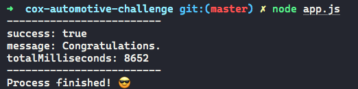
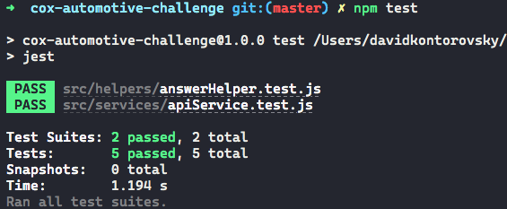

# Coding Challenge

## Program Description

This program retrieves data from an API, performs several operations to model a required answer, and posts the answer back to the API.

For more details refer to the challenge's website: <a href="http://api.coxauto-interview.com/" target="_blank">Programming Challenge Site</a>

The program was developed using NodeJS / JavaScript.

## How to Run this Program

- Open terminal.
- Make sure to have Node v14+ and npm installed.
- Locate root directory.
- Run npm install:

```bash
npm install
```

- Run the program with node command from the root directory:

```bash
node app.js
```

- Wait a few seconds and you will see the result.



## Tests

Jest tests have been added to verify some of the features.
They are located under:

```
/src/helpers/answerHelper.test.js
/src/services/apiService.test.js
```

To run the tests enter this command from the root directory:

```
npm test
```


